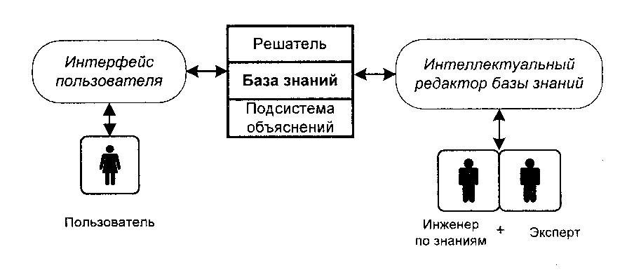

<!-- Adventures in Rule-Based Programming: A CLIPS Tutorial 
https://www.amazon.com/Adventures-Rule-Based-Programming-CLIPS-Tutorial/dp/B09ZCL2VMM
979-8985783902

dnf install clips 

-->
\setcounter{section}{-1}
\refstepcounter{section}
# Введение {-}

Экспертные системы --- системы, основанные на моделях знаний из
определённых предметных областей.

Экспертная система заключает в себе знания высококвалифицированного
специалиста в определенной предметной области и используется для
консультаций, помощи в принятии сложных решений, для решения
неформализованных задач.

В данном отчёте представлена разработанная в ходе курсовой работы
экспертная система в среде CLIPS, выполняющая рольинтерактивного текстового квеста с выбором вариантов ответа.

# Постановка задачи

В курсовой работе требуется:

<!-- - выбрать предметную область (согласовать ее с преподавателем),
построить продукционную модель экспертной системы (например, поиска неисправности)
и согласовать ее с преподавателем. -->

- Реализовать экспертную систему в среде CLIPS на основе продукционной
модели в заданной предметной области.

- Реализовать пользовательский интерфейс с возможностью ввода ответов, представляющих выбор из нескольких вариатов.
и вывода результата работы экспертной системы.

Требования к ациклическому связному графу переходов:

- Минимальная глубина (длина пути от начальной вершины до одной из конечных): 4 (перехода), минимальное число узлов --- 30.

# Предметная область

Предметной областью экспертной системы является
выбор вариантов развития сюжета в текстовом квесте.

С формальной точки зрения, текстовый квест состоит из текстовых _блоков_,
каждый из которых заканчивается выбором варианта либо реплики героя истории, либо его действия (бездействия).
Выбор того или иного варианта игроком (пользователем) определяет дальнейшее развитие сюжета.

С художественной точки зрения, текстовый квест представляет из себя интерактивную историю, то есть такую,
в которой читатель может повлиять на ход истории или предрешить ее концовку
(например, правильные выборы могут привести к счастливой концовке,
неправильные к плохой). Подобное решение позволяет сильнее вовлечь читателя, в отличии от линейного повествования
в литературе классического формата.

Для решения данной проблемы была разработана экспертная система в среде
CLIPS.

В качестве литературного источника была взята повесть «Хоббит, или Туда и обратно» английского писателя Дж. Р. Р. Толкина.
Герой истории --- хоббит Бильбо Беггинс, действие происходит в мире Средиземья.

На рис. \ref{fig:condense} представлен граф переходов после стягивания цепочек, представляющий различные пути прохождения квеста.
Дугами обозначены различные варианты выбора, узлами --- линейные участки истории.


# Математическое описание

## Экспертная система и их особенности

**Экспертная система** --- это программа, которая
оперирует знаниями в определенной предметной области с целью выработки
рекомендаций или решения проблем.

Экспертные системы главным образом основаны на эвристическом поиске
решения, что является одним из главных преимуществ технологии экспертных
систем перед традиционным подходом к разработке программ.[@vostrov]

**Задачи, решаемые экспертными системами:**

-   Извлечение информации из первичных данных;

-   Диагностика неисправностей;

-   Структурный анализ сложных объектов;

-   Выбор конфигурации сложных многокомпонентных систем;

-   Планирование последовательности выполнения операций, приводящих к
    заданной цели.[@jackson2001]

**Функции экспертных систем:**

-   Приобретение знаний;

-   Представление знаний в удобной для работы форме; процессом поиска
    решений. [@jackson2001]

**Экспертная система работает в двух основных режимах:**

1. в режиме приобретения знаний;

2. в режиме решения задачи.[@vostrov]

## Основные компоненты экспертной системы

На Рис. \ref{fig:es struct} представлена обобщенная структура экспертной системы.



-   *База данных* используется для хранения исходных и промежуточных
    данных решаемой задачи.

-   *База знаний* предназначена для хранения долгосрочных данных,
    которые описывают рассматриваемую предметную область. Кроме того,
    база знаний хранит правила, используемые для оперирования данными.
    Правила представляют собой типовые алгоритмы обработки данных,
    которые позволяют получить новые знания из имеющихся данных. Другими
    словами, база знаний - набор таких закономерностей, которые
    устанавливают связи между вводимой и выводимой информацией. В
    формировании базы знаний участвуют эксперты, инженеры по знаниям,
    программисты.

-   *Эксперт*  --- человек, способный находить правильные решения проблем в
    конкретной предметной области. Эксперт использует свои приёмы, чтобы
    сделать поиск решения более эффективным. Экспертная система
    моделирует все его стратегии поиска решений.

    Задача эксперта состоит в определении данных и правил, которые
    достаточно полно характеризуют предметную область. Кроме того,
    эксперт обеспечивает полноту и правильность имеющейся базы знаний.

-   *Инженер знаний* --- человек, имеющий познания в информатике и
    искусственном интеллекте и знающий, как надо строить экспертную
    систему. Инженер знаний опрашивает экспертов, организует знания,
    решает, каким образом они должны быть представлены в ЭС, и может
    помочь программисту в написании программ. В задачи инженера знаний
    входит: обеспечение, структурирование знаний, выбор наиболее
    подходящего для решения поставленных задач программного средства.

-   *Программист* --- специалист в области разработки программного
    обеспечения. Реализует экспертную систему на практике. Задача
    программиста: разработка небходимых программных средств и
    осуществление сопряжения этих средств с программным окружением
    экспертной системы.

-   *Пользователь* --- человек, который использует экспертную систему.

    Термин пользователь неоднозначен.

    Пользователем также может быть:

    - создатель инструмента, отлаживающий средство построения ЭС;

    - инженер знаний, уточняющий существующие в ЭС знания;

    - эксперт, добавляющий в систему новые знания;

-   *Интерфейс пользователя* --- комплекс программ, реализующих диалог
    пользователя с ЭС как на стадии ввода информации, так и на стадии
    получения результатов.[@jackson2001].

## Характерные черты экспертной системы

Экспертная система обычно проектируется таким образом, чтобы она обладала
описанными ниже общими характеристиками.

- Высокая эффективность. Система должна обладать способностью давать
ответы на уровне компетентности, равной или более высокой по сравнению
с экспертом в данной области.
- Приемлемое время отклика. Система должна выполнять свою работу за
приемлемое время.
- Высокая надежность. Экспертная система должна быть надежной и не
    подверженной сбоям;
- Доступность для понимания;
- Гибкость. Важно иметь эффективный механизм добавления,
модификации и удаления знаний[@djarratano2007].

## Продукционная модель

Продукционная модель является моделью представления знаний, основанная
на правилах, позволяющая представить знания в виде предложений типа:

```plain
IF <условие>, THEN <действие>.
```

«Условие» (антецедент) --- некоторое предложение-образец, по которому
осуществляется поиск в базе знаний.

«Действие» (консеквент) --- действия, выполняемые при успешном исходе
поиска (они могут быть промежуточными, выступающими далее как условия и
терминальными или целевыми, завершающими работу системы).[@chast2001]

*Преимущества продукционной модели:*

-  простота создания и понимания отдельных правил;

-  простота механизма логического выбора.

*Недостатки продукционной модели:*

-  отличие от структур знаний, свойственных человеку;

-  неясность взаимных отношений правил;

-  сложность оценки целостного образа знаний;

-  низкая эффективность обработки знаний. [@vostrov]

## Ориентированный ациклический граф решений

Экспертная система представлена ациклическим орграфом решений --- обобщением бинарного дерева решений с причинно-следственной связью. Стартовым узлом является блок «Как-то тихим утром вы, плотно подзакусив и покуривая трубку...». В орграфе решений блок --- это
узлы решения, а конечные результаты --- это конечные узлы.

В итоге работа экспертной системы означает путь по графу. Такой путь
состоит из последовательности однотипных шагов, на каждом из которых
пользователь должен решить, по какой дуге он пойдет из очередного узла.

Сформированный в ходе выполнения курсовой работы орграф решений
содержит 40 узлов с условиями. Например, такими как, 
«Таким же способом внутри вашей норы оказывается еще дюжина гномов...Вы задумываетесь о выборе.»,
или «Дни в крепости эльфов...А тем временем вы — единственный из отряда, кто еще способен изменить ситуацию — для себя или для отряда.».

Для краткости выше часть текста опущена многоточием. Полный список фактов см. в приложении +.

(Также, дерево содержит два конечных узла. См. [Предметная область].)

На рисунке \ref{fig:full dag} представлен полный орграф решений, текст в узлах заменен идентификаторами.


# Особенности реализации

Экспертная система была реализована в среде разработки CLIPS.

CLIPS поддерживает эвристическую и процедурную парадигму представления
знаний. Для представления знаний в процедурной парадигме CLIPS
предоставляет такие механизмы, как глобальные переменные, функции и
родовые функции.

Правила в CLIPS служат для представления эвристик или так называемых
«эмпирических правил», которые определяют набор команд, выполняемых
при возникновении некоторой ситуации. Реализуется некоторый набор
правил, которые вместе работают над решением задачи. Правила состоят из
предпосылок и следствия.

Предпосылки называются ЕСЛИ-частью правила, левой частью правила или LHS
правила (left-hand side of rule). Следствие называется ТО-частью
правила, правой частью правила или RHS правила (right-hand side of
rule).[@chast2001]

Реализация данной экспертной системы активно использует
управляющие команды CLIPS, такие как if-then-else и while.

*Структура правила:*

добавления новых правил в базу знаний CLIPS
предоставляет специальный конструктор `defrule`.[@chast2001] В основу программы
положена шаблонная функция `assert`, с помощью которой задается вопрос
пользователю, а на экране появляется следующий вопрос.

Таким образом, двигаясь от корневого узла бинарного дерева, то есть от
вопроса , пользователь
переходит от вопроса к вопросу, с помощью выбора варианта вводом одного символа из перечня `a/b/c/d`, пока не дойдет до конечного факта.

*Корневой узел:*

От ответа пользователя зависит движение по дереву. Последующие узлы
заданы таким образом:
+

+средства абстракции `deftemplate`

# Результаты работы программы

На Рис. \ref{}-\ref{} представлены результаты работы программы.

После запуска программы выводится первый вопрос, находящийся в корне
бинарного дерева. Пользователь с помощью ответов `a/b/c/d` отвечает на все
последующие вопросы и получает рекомендацию +. В случае повторного использования
системы программа очищает консоль, и на экране снова отображается первый
вопрос.

\newpage\refstepcounter{section}
# Заключение {-}

В результате курсовой работы была изучена среда разработки CLIPS и
реализована экспертная система + в среде CLIPS.

Основные преимущества инструментального средства CLIPS:

-   данное программное обеспечение свободно распространяется;

-   мультиплатформенность;

-   наличие полной открытой документации;

-   наличие программного интерфейса (позволяет встраивать его в программные продукты, написанные на языке C, Java и др.);

-   чётко сформулированный синтаксис.

<!-- Однако CLIPS не имеет возможностей инкапсуляции, полиморфизма,
наследования. -->

<!-- Реализованное программно бинарное дерево решений имеет узлы --- вопросы
(30 узлов), листья -- факты - рекомендованный архитектурный стиль (32
узла). Итого 62 узла, 5 ярусов и корневой узел. -->

Преимущества использования экспертных систем по сравнению с
использованием опытных специалистов состоит в следующем:

-   устойчивость и воспроизводимость результатов

-   лёгкость передачи

-   постоянство

-   стоимость

Моделью представления знания реализованной системы является
продукционная модель.

*Достоинства продукционной модели:*

-   простая и понятная структура;

-   алгоритм поиска в бинарном дереве эффективен даже для больших
    наборов данных.

*Недостатки продукционной модели:*

-   не является гибкой, неудобство изменения дерева. При необходимости
    добавления нового узла необходимо изменять дерево решений и менять
    реализацию экспертной системы.

-   условное разделение предметной области

-   сложность проверки непротиворечивости системы при добавлении
    большого числа условий.

<!-- Реализованная программа легко масштабируема, присутствует возможность
добавления других признаков архитектурных стилей для увеличения
точности, а также использование реальных данных из открытого доступа для
увеличения актуальности фактов. -->

Экспертная система представлена деревом, что делает поиск решения
быстрым. Однако система не является полной, многие решения требуют
дополнения, для которого нужно задать пользователю больше вопросов, что
может быть невозможно, например, в экстремальной ситуации или в условиях
ограниченного времени.

Программа может быть масштабирована для представления экспертных систем,
где моделью представления знаний являются семантические сети.

\newpage\refstepcounter{section}
# Список использованных источников {-}

::: {#refs}
:::