# Введение {-}

## Постановка задачи {-}

### Лабораторная работа 1 {-}

1. Сформировать случайным образом связный ациклический граф, выходные степени вершин которого подчиняются
   распределению Пойя 1 (параметры распределения задаются как константы),
   с необходимым количеством вершин.
   <!-- Распределение лучше всего брать из справочника Вадзинского (есть в списке литературы). -->
2. Реализовать метод Шимбелла на полученном графе
   (пользователь вводит количество ребер).
3. Определить возможность построения маршрута от одной заданной точки до другой
   (вершины вводит пользователь) и указывать количество таковых маршрутов.

### Лабораторная работа 2 {-}

1. Для заданных графов (случайно сгенерированных в предыдущей работе)
   найти кратчайший путь для выбранных точек, используя алгоритмы Дейкстры, Беллмана-Форда, Флойда
   (пользователь вводит номера вершин начальной и конечной).
   Для алгоритмов Дейкстры и Беллмана-Форда рекомендуется выводить вектор расстояний,
   для Флойда-Уоршалла --- матрицу расстояний. Обязательно выводить сам путь в виде последовательности вершин.
2. Сравнить скорости работы данных алгоритмов (по количеству итераций).

### Лабораторная работа 3 {-}

1. Сформировать связный ациклический граф случайным образом в соответствии с заданным распределением.
	 На его основе построить матрицы пропускных способностей и стоимости.

2. Для полученного графа найти максимальный поток по алгоритму
	 Форда-Фалкерсона (или любого из перечисленных в лекции).

3. Вычислить поток минимальной стоимости (в качестве величины потока брать значение,
	 равное $\frac 2 3 f_{\max}$, где $f_{\max}$ --- максимальный поток).
	 Использовать ранее реализованные алгоритмы Дейкстры и/или Беллмана–Форда.

### Лабораторная работа 4 {-}

1. Для заданных графов (случайно сгенерированных в первой работе)
		построить минимальный по весу остов, используя алгоритмы Прима и Краскала.
		<!-- (алгоритм Борувки - факультативно) -->
		Сравнить данные алгоритмы (итерации).

2. Используя матричную теорему Кирхгофа, найти число остовных деревьев в графе.

3. Полученный остов закодировать с помощью кода Прюфера
		(проверить правильность кодирования декодированием).
		Желательно сохранять веса при кодировании.

### Лабораторная работа 5 {-}

1. Для заданных графов (случайно сгенерированных в первой работе) проверить,
		является ли граф эйлеровым и гамильтоновым. Если граф не является таковым,
		то отдельно модифицировать граф до эйлерова и отдельно до гамильтонова
		(до полного графа можно дополнять только в крайнем случае!).

2. Построить эйлеров цикл.

3. Решить задачу коммивояжёра на гамильтоновом графе
		(все гамильтоновы циклы с суммарным весом выводить либо на экран,
		если их мало, либо в файл).

# Математическое описание

Неориентированным графом $G(V,E)$ называется совокупность двух множеств ---
непустого множества _вершин_ $V$ и множества _рёбер_ $E$,
\begin{gather*}
G(V, E) ≝ ⟨V;E⟩,
\\ V ≠ ∅,
\\ E ⊂ 2^V ∧ ∀e ∈ E (|e| = 2).
\end{gather*}

Ориентированным графом $G(V,E)$ называется совокупность двух множеств ---
непустого множества _узлов_ $V$ и множества _дуг_ $E$,
\begin{gather*}
G(V, E) ≝ ⟨V;E⟩,\\ V ≠ ∅,\quad E ⊂ V^2.
\end{gather*}

Число вершин графа $G$ обозначим $p$, а число рёбер — $q$:
\begin{gather*}
p ≝ p(G) ≝ |V|,\\
q ≝ q(G) ≝ |E|.
\end{gather*}

<!-- степень вершины? -->

## Связность

_Маршрутом_ в графе называется чередующаяся последовательность вершин и рёбер,
начинающаяся и кончающаяся вершиной, $v_0, e_1, v_1, e_2, v_2,\dotsc, e_k, v_k$, в которой
любые два соседних элемента инцидентны, причём однородные элементы (вершины,
рёбра) через один смежны или совпадают.

Если $v_0 = v_k$, то маршрут _замкнут_, иначе — _открыт_. Если все рёбра различны,
то маршрут называется _цепью_. Если все вершины (а значит, и рёбра) различны,
то маршрут называется _простой цепью_.

Говорят, что две вершины в графе _связаны_, если
существует соединяющая их (простая) цепь. Граф, в
котором все вершины связаны, называется _связным_.

Отношение связанности вершин является эквивалентностью.
Классы эквивалентности по отношению связанности называются _компонентами связности_ графа.

Число компонентов связности графа $G$ обозначается
$k(G)$.

Граф $G$ связный $⟺ k(G) = 1$.

Если $k(G) > 1$, то $G$ — _несвязный_ граф.

Замкнутая цепь называется _циклом_; замкнутая простая цепь называется _простым
циклом_. Число циклов в графе $G$ обозначается $z(G)$. Граф без циклов называется
ациклическим ($z(G) = 0$).

## Метод Шимбелла

Пусть граф задан матрицей $Ω = (ω_{ij})$ весов ребер, т.е.
$$ ω_{ij} = \begin{cases}
	0, & \text{если вершины }i, j\text{ не смежны},\\
	ω, & \text{если вес ребра }ij = ω.
\end{cases}
$$

Введем специальные операции над элементами матрицы
смежности вершин, позволяющие находить кратчайшие или максимальные пути между
вершинами,
состоящие из заданного количества ребер. Эти операции таковы.

1) Операция умножения двух величин $a$ и $b$ при возведении матрицы в степень
соответствует их алгебраической сумме, то есть
	$$ \begin{cases}
   	a ⋅ b ≝ a+b\\
   	a ⋅ 0 = 0 ⋅ a ≝ 0
 	\end{cases}
	$$

2) Операция сложения двух величин $a$ и $b$ заменяется выбором из этих величин
минимального (максимального) элемента, то есть
	\begin{equation}
	\begin{cases}
		a+b ≝ \min (\max)\{a, b\}\\
		a + 0 = 0 + a ≝ a
	\end{cases}\label{eq:shimbell_mul}
	\end{equation} 

	нули при этом игнорируются. Минимальный или максимальный элемент выбирается из
	ненулевых элементов. Нуль в результате операции (\ref{eq:shimbell_mul}) может быть получен лишь тогда,
	когда все элементы из выбираемых --- нулевые.

С помощью этих операций длины кратчайших или максимальных путей между всеми
вершинами определяется возведением в степень весовой матрицы $Ω$, содержащей веса
ребер. Например, элементы матрицы $Ω^2 =\left(ω^{(2)}_{ij}\right)$ определяются следующим образом
$$ ω^{(2)}_{ij} = \min_k (\max_k) \left\{ω^{(1)}_{ik} + ω^{(1)}_{kj}\right\}.
$$

Аналогично определяются элементы матрицы $Ω^m =\left(ω^{(m)}_{ij}\right)$.
Длина кратчайшего или максимального пути из $m$ ребер от вершины $i$ до вершины $j$ равна $ω^{(m)}_{ij}$[@shaporev2006].

## Распределение Пойа 1

Ряд распределения дискретной случайной величины $X$ --- совокупность
всех ее возможных значений $x_1,\dotsc,x_n$, и вероятностей $p_1,\dotsc,p_n$, появления каждого из этих значений.

Примем как обозначение $∏\limits_{k=0}^{-1} f(k) = 1$ (как произведение пустого множества элементов).

Ряд распределение Пойа ---

$$ p(x) = C_n^x \frac {∏\limits_{k=0}^{x-1} (b+kc) ∏\limits_{k=0}^{n-x-1} (r+kc)} {∏\limits_{k=0}^{n-1}(b + r + kc)},
\ x=0,1,2,\dotsc, n.
$$	

В частности,
$$
p(0) = ∏_{k=0}^{n-1} \frac {r + kc}
         {b + r + kc},
\quad
p(n) = ∏_{k=0}^{n-1} \frac {b + kc}
         {b + r + kc},
$$

где $n>0$, $b>0$, $r>0$, $c ∈ ℤ$. Параметр $c$ может быть отрицательным,
однако он должен удовлетворять условию $b+r+c(n-1)>0$[@vadzinsky2001].

\begin{algorithm}
  \caption{Генерации случайного числа, подчиняющегося распределению Пойа 1}
  \label{alg:poja}
\begin{algorithmic}
\Require $n>0$, $b>0$, $r>0$, $c ∈ ℤ$
\Ensure случайное число из множества $\{0,1,\dotsc, n\}$
\State $p := p_0$
\Comment{$p_0 = p(0)$}
\State $r :=$ \Call{Rand}{}
\Comment{$r ∈ [0, 1]⊂ℝ$, случайное с равномерным распределением}
\For{$x := 0,n-1$}
	\State $r := r - p$
	\If{$r < 0$}
		\State \Return $x$
	\EndIf
	\State $p := p ⋅ α(x)$
	\Comment{$α(x) = \dfrac {(n+1-x)\left(b + (x-1)c\right)}{x \left(r + (n-x)\right) c}$}
\EndFor
\State \Return $n$
\end{algorithmic}
\end{algorithm}

## Вспомогательные процедуры

Во многих алгоритмах поиска кратчайших путей используются две процедуры.
Процедура инициализации \textsc{Init}($s$) строит начальное состояние матрицы длин путей
и матрицы предшествования.

\begin{algorithmic}
\Require узел $s$
\Ensure заполненные матрицы $T$ :\Array{1..$p$, 1..$p$}{\Real} длин путей и\\
 $Π$: \Array{1..$p$, 1..$p$}{0..$p$} самих путей.
\Procedure{Init}{$s$}
\For{$v := 1,p$}
\State $T [v] := +∞$, $Π[v] := 0$
\EndFor
\State $T[s] := 0$
\EndProcedure
\end{algorithmic}

Процедура ослабления, или релаксации, — \textsc{Relax}($s$, $v$, $u$) проверяет, возможно ли
улучшить известный путь из узла $s$ в узел $v$, проведя новый путь через узел $u$,
и обновляет пути, если это возможно.

\begin{algorithmic}
\Require узлы $s$, $v$, $u$\\
матрица $W$ : \Array{1..$p$, 1..$p$}{\Real} длин дуг,\\
матрица $T$ : \Array{1..$p$, 1..$p$}{\Real} длин путей,\\
матрица $Π$ : \Array{1..$p$, 1..$p$}{0..$p$} самих путей.
\Ensure обновленные матрицы $T$, $Π$
\Procedure{Relax}{$s$, $v$, $u$}
\If {$T [s, v] > T [s, u] + W [u, v]$}
\State $T [s, v] := T [s, u] + W [u, v]$; $Π[s, v] := u$ \Comment{новый путь короче}
\EndIf
\EndProcedure
\end{algorithmic}

Восстановление пути по матрице предшествования $Π$ можно произвести так:
<!-- 389 -->

\begin{algorithmic}
\State $w := v$; \Yield $w$ \Comment{последний узел}
\While{$w ≠ u$}
	\State $w := Π[u, w]$
	\State \Yield $w$ \Comment{предыдущий узел}
\EndWhile
\end{algorithmic}

Полученную последовательность можно обратить, если это потребуется, и получить прямой
порядок узлов пути.

## Алгоритм Дейкстры

Алгоритм Дейкстры \ref{alg:dijkstra} находит кратчайший путь между двумя данными вершинами
(узлами) в (ор)графе, если длины дуг неотрицательны[@novikov2008].

_Сложность алгоритма_: $𝒪(p^2)$.

\begin{algorithm}
  \caption{Дейкстры поиска кратчайших путей}\label{alg:dijkstra}
  \begin{algorithmic}
  \Require
  	взвешенный орграф $G(V, E)$,\\
  	матрица весов $W$ : \Array{1..$p$, 1..$p$}{\Real},\\
		источник $s$.
  \Ensure
  	вектор $T$ : \Array{1..$p$}{\Real} длин кратчайших путей от источника,\\
  	вектор $Π$ : \Array{1..$p$}{0..$p$} самих путей.
  \State \Call{Init}{$s$} \Comment{инициализация}
  \State $Q:=V$ \Comment{контейнер (очередь с приоритетами)}
  \While{$Q≠∅$}
		\State $u$ := \Call{ExtractMin}{$Q$} \Comment{извлечение узла с минимальным значением $T[u]$}
		\If{$T[u] = ∞$} \Stop \EndIf \Comment{остальные узлы недостижимы из $s$}
		\ForAll{$v ∈ Γ(u)$}
			\If{$v ∈ Q$}
				\State \Call{Relax}{$s$, $v$, $u$} \Comment{релаксация дуги $(u, v)$}
			\EndIf
		\EndFor
  \EndWhile
  \end{algorithmic}
\end{algorithm}

## Алгоритм Беллмана-Форда

Алгоритм Беллмана-Форда \ref{alg:bellman-ford} находит кратчайшие пути во взвешенном графе,
не содержащем циклы с отрицательным суммарным весом, от одной вершины до всех остальных[@shaporev2006].

При этом алгоритм Беллмана-Форда позволяет определить наличие циклов
отрицательного веса, достижимых из начальной вершины.

_Сложность алгоритма_: $𝒪(pq)$, где $p$ — количество вершин, $q$ — количество ребер.

\begin{algorithm}
  \caption{Беллмана–Форда}\label{alg:bellman-ford}
  \begin{algorithmic}
  \Require
  	взвешенный орграф $G(V, E)$,
  	матрица весов $W$ : \Array{1..$p$, 1..$p$}{\Real},
		источник $s$.
  \Ensure
  	вектор $T$ : \Array{1..$p$}{\Real} длин кратчайших путей от источника,\\
  	вектор $Π$ : \Array{1..$p$}{0..$p$} самих путей.
  \State \Call{Init}{$s$} \Comment{инициализация}
	\For{$i := 1, p − 1$}
	\ForAll{$(u, v) ∈ E$}
	\State \Call{Relax}{$s$, $v$, $u$}
	\EndFor
	\EndFor
	\ForAll{$(u, v) ∈ E$} \Comment{проверка на отрицательные контуры}
	\If{$T [v] > T [u] + W [u, v]$}
	\Stop \Comment{найден контур отрицательного веса}
	\EndIf
	\EndFor
  \end{algorithmic}
\end{algorithm}

## Алгоритм Флойда-Уоршелла

Алгоритм Флойда-Уоршелла \ref{alg:floydworshall} находит кратчайшие пути между всеми парами 
вершин (узлов) в (ор)графе. Веса ребер могут быть как положительными, так и 
отрицательными.

Для нахождения кратчайших путей между всеми вершинами графа 
используется восходящее динамическое программирование, то есть все подзадачи, которые 
впоследсвии понадобятся для решения исходной задачи, просчитываются заранее, а затем
используются[@novikov2008].

<!-- про циклы отрицательного суммарного веса -->
Алгоритм не всегда выдаёт
решение, поскольку оно не всегда определено.
Дополнительный цикл по $j$ служит
для прекращения работы в случае обнаружения в орграфе контура с отрицательным
весом.

_Идея алгоритма_ — разбиение процесса поиска кратчайших путей на фазы.

_Сложность алгоритма_: $𝒪(p^3)$.

\begin{algorithm}
  \caption{Флойда-Уоршалла поиска всех кратчайших путей}\label{alg:floydworshall}
  \begin{algorithmic}
  \Require
  	матрица $W$ : \Array{1..$p$, 1..$p$}{\Real}  длин дуг.
  \Ensure матрица $T$: \Array{1..$p$, 1..$p$}{\Real} длин путей и\\
          матрица $Π$: \Array{1..$p$, 1..$p$}{0..$p$} самих путей.
\For{$i := 1, p$} \Comment{инициализация}
\For{$j := 1, p$}
\State $T [i, j] := W [i, j]$
\If{$W[i, j] = ∞$}
\State $Π[i, j] := 0$ \Comment{нет дуги из $i$ в $j$}
\Else
\State $Π[i, j] := i$ \Comment{есть дуга из $i$ в $j$}
\EndIf
\EndFor
\EndFor
\For{$i := 1, p$}
\For{$j := 1, p$}
\For{$k := 1, p$}
\If{$\begin{cases} i ≠ j ∧ T [j, i] ≠ ∞ \\ i ≠ k ∧ T [i, k] ≠ ∞ \\ T [j, k] = ∞ ∨ T [j, k] > T [j, i] + T [i, k] \end{cases}$}
\State $T [j, k] := T [j, i] + T [i, k]$ \Comment{запомнить длину нового пути}
\State $Π[j, k] := i$ \Comment{и сам путь}
\EndIf
\EndFor
\EndFor
\For{$j := 1, p$}
\If{$T [j, j] < 0$}
\Stop \Comment{Узел $j$ входит в отрицательный контур}
\EndIf
\EndFor
\EndFor
\end{algorithmic}
\end{algorithm}

## Максимальный поток в сети

Пусть $G(V,E,c)$ --- сеть, $s$ и $t$ --- cоответственно, источник и сток сети.
Дуги сети нагружены неотрицательными вещественными числами, $c:\ E → ℝ_+$.
Если $u$ и $v$ --- узлы сети, то число $c(u,v)$ --- называется _пропускной способностью_ дуги $(u,v)$. 

_Дивергенцией функции_ $f$ в узле $v$ называется число $\div(f, v)$, которое определяется следующим образом:

$$ \div(f,u) ≝ ∑_{v|(u,v) ∈ E} f(u,v) \quad- ∑_{v|(u,v) ∈ E} f(v,u)
$$

Функция $f: E → ℝ$ называется _потоком_ в сети $G$, если:

1. $∀ (u,v) ∈ E (0 ⩽ f(u,v) ⩽ c(u,v))$,
		то есть поток через дугу неотрицателен и не превосходит пропускной способности дуги.
2. $∀ u ∈ V ⧵ \{s,t\} (\div(f,u)=0)$, то есть дивергенция потока равна нулю во всех узлах,
		кроме источника и стока.

_Величина потока в сети_ $G$ --- сумма всех потоков,
выходящих из истока, то есть[@novikov2008]
$$ w(f) = \div(f,s).
$$

Рассмотрим пару
вершин $u,v∈V$. Определим _остаточную пропускную способность_
$c_f(u,v)$ как
$$ c_f(u,v) = \begin{cases}
	c(u,v) - f(u,v), & \text{если }(u,v)∈E,\\
	f(v,u),          & \text{если }(v,u)∈E,\\
	0                & \text{иначе.}
\end{cases}
$$

## Алгоритм Форда-Фалкерсона

_Теорема Форда-Фалкерсона_ Максимальный поток в сети равен минимальной пропускной способности разреза, то есть существует поток $f^*$ такой, что 
$$ w(f^*) = \max_f w(f) = \min_P C(P).
$$

На основе данной теоремы реализуется алгоритм Форда-Фалкерсона для определения максимального потока в сети,
заданной матрицей пропускных способностей дуг.

Алгоритм Форда-Фалкерсона решает задачу нахождения максимального потока в транспортной сети[@novikov2008].

Приведенная реализация \ref{alg:ffulk} метода Форда-Фалкерсона вычисляет максимальный поток в транспортной сети
$G(V, E)$ путем обновления
атрибута потока $(u,v).f$ каждого ребра $(u,v)∈E$.
Если $(u,v)∉E$, неявно предполагается, что $(u,v).f=0$.

\begin{algorithm}
\caption{Форда-Фалкерсона нахождения максимального потока в сети}\label{alg:ffulk}
\begin{algorithmic}
\Require Граф $G(V,E)$,
источник $s$ и сток $t$ сети.

Пропускные способности $c(u,v)$, $c(u,v) = 0$ если $(u,v)∉E$.
\Ensure 
\For{$(u,v)∈E$}
	\State $(u,v).f = 0$
\EndFor
\While{существует путь $p$ из $s$ в $t$ в остаточной сети $G_f$}
	\State $c_f(p) := \min \{ c_f(u,v) : (u,v)∈p \}$ \Comment{$c_f(p)$ --- локальная переменная цикла}
	\For{$(u,v) ∈ p$}
		\If{$(u,v)∈E$}
			 $(u,v).f := (u,v).f + c_f(p)$
		\Else
			 $\ (v,u).f := (v,u).f - c_f(p)$
		\EndIf
	\EndFor
\EndWhile
\end{algorithmic}
\end{algorithm}

Можно улучшить временную границу алгоритма \ref{alg:ffulk}, если реализовать вычисление увеличивающего пути $p$ в строке __while__ как поиск в ширину,
т.е. если в качестве увеличивающего пути выбрать кратчайший путь из $s$ в $t$
в остаточной сети, где каждое ребро имеет единичную длину (вес). Такая реализация метода Форда-Фалкерсона называется _алгоритмом Эдмондса-Карпа_
(Edmonds-Karp algorithm)[@cormen2013].

_Сложность алгоритма_: $𝒪(p⋅q^2)$.

## Вычисление потока минимальной стоимости

Рассмотрим задачу определения потока заданной величины $θ$ от $s$ к $t$ в сети
$G(V,E,c,d)$, в которой каждая дуга $(u,v) ∈ E$ характеризуется не только пропускной способностью
$c(u,v)$, но и неотрицательной стоимостью $d(u,v)$ пересылки единичного потока из
$i$ в $j$ вдоль дуги $(u,v)$. $d:\ E → ℝ_+$.

Если $θ>f_{\max}$, где $f_{\max}$ --- величина максимального потока в сети $G$ от $s$ к $t$,
то решения нет.
Если же $θ⩽f_{\max}$, то может быть определено несколько различных потоков величины
$θ$ от $s$ к $t$.

Математическая модель задачи ---
минимизировать целевую функцию выбором потока $f$:

$$ ∑_{(u,v) ∈ E} d(u,v) ⋅ f(u,v) → \min_{f},
$$

где $d(u,v)$ --- вес дуги $(u,v)$, $f(u,v)$ --- величина потока вдоль дуги $(u,v)$[@shaporev2006].

## Задача определения максимального потока в сети с несколькими истоками и несколькими стоками

В задаче о максимальном потоке может быть несколько истоков и стоков. Например,
$m$ истоков $\{ s_1, s_2, \dotsc, s_m\}$ и
$n$ стоков $\{t_1,t_2, \dotsc,t_n\}$.

Задача определения максимальном потока в сети с несколькими истоками
и несколькими стоками сводится к обычной задаче о максимальном потоке.
Для этого в сеть добавляется _фиктивный исток_ (supersource) $s$
и ориентированные ребра $(s, s_i)$ с пропускной способностью
$$ c(s,s_i)=∞, \qquad i = 1,\dotsc,m.
$$
Точно так же создается _фиктивный сток_ (supresink) $t$ и добавляются ориентированные ребра $(t_i, t)$, обладающие
$$ c(t_i , t) = ∞, \qquad i=1,\dotsc,n.
$$

Единственный исток $s$ обеспечивает поток любой требуемой величины к истокам $s_i$, а единственный сток $t$ аналогичным образом потребляет поток любой желаемой величины от множественных стоков $t_i$[@cormen2013].

## Минимальный остов

_Остовным деревом_ или _остовом_ графа $G(V, E)$ называется связный подграф без циклов, содержащий все вершины исходного графа.
Любое остовное дерево в графе с $|V| = n$ вершинами
содержит ровно $n-1$ ребро.

_Минимальное остовное дерево_ — это остовное дерево,
сумма весов ребер которого минимальна.

_Задача о минимальном остове_: во взвешенном связном графе найти остов минимального веса, то есть остов, суммарный вес ребер которого является минимальным[@novikov2008].

## Алгоритм Прима

Алгоритм Прима --- алгоритм построения минимального остовного дерева взвешенного связного неориентированного графа.

В данном алгоритме кратчайший остов порождается в процессе разрастания одного дерева, к которому присоединяются ближайшие одиночные вершины.
При этом для каждой вершины $v$, кроме начальной,
используются две пометки: $α[v]$ — это ближайшая
к $v$ вершина, уже включённая в остов, а $β[v]$ — это длина ребра, соединяющего $v$ с остовом.
Если вершину $v$ ещё нельзя соединить с остовом одним ребром, то
$α[v] := 0$, $β[v] := ∞$.

На выходе мы получаем множество ребер, которые лежат в минимальном остовном дереве[@novikov2008].

\begin{algorithm}
\caption{Прима, нахождения остовного дерева минимальной стоимости}\label{alg:prim}
\begin{algorithmic}
\Require граф $G(V, E)$, заданный матрицей длин рёбер $C$.
\Ensure множество $T$ рёбер кратчайшего остова.
\State \Select $u ∈ V$ \Comment{выбираем произвольную вершину}
\State $S :=\{u\}$ \Comment{$S$ — множество вершин, включённых в кратчайший остов}
\State $T := ∅$ \Comment{$T$ — множество рёбер, включённых в кратчайший остов}
\For{$v ∈ V − u$}
\If{$v ∈ Γ(u)$}
\State $α[v] := u$ \Comment{$u$ — ближайшая вершина остова}
\State $β[v] := C[u, v]$ \Comment{$C[u, v]$ — длина соответствующего ребра}
\Else
\State $α[v] := 0$ \Comment{ближайшая вершина остова неизвестна}
\State $β[v] := ∞$ \Comment{и расстояние также неизвестно}
\EndIf
\EndFor
\For{$i:=1,p−1$}
\State $x := ∞$ \Comment{начальное значение для поиска ближайшей вершины}
\For{$v ∈ V ⧵ S$}
\If{$β[v] < x$}
\State $w := v$ \Comment{нашли более близкую вершину}
\State $x := β[v]$ \Comment{и расстояние до неё}
\EndIf
\EndFor
\State $S := S + w$ \Comment{добавляем найденную вершину в остов}
\State $T := T + (α[w], w)$ \Comment{добавляем найденное ребро в остов}
\For{$v ∈ Γ(w)$}
\If{$v ∉ S ∧ β[v] > C[v, w]$}
\State $α[v] := w$ \Comment{изменяем ближайшую вершину остова}
\State $β[v] := C[v, w]$ \Comment{и длину ведущего к ней ребра}
\EndIf
\EndFor
\EndFor
\end{algorithmic}
\end{algorithm}

_Сложность алгоритма_: $𝒪(n^2)$.

## Алгоритм Краскала

Алгоритм Краскала --- жадный алгоритм построения минимального остовного дерева
взвешенного связного неориентированного графа.

Алгоритм \ref{alg:kruskal} состоит из двух фаз.

1. На подготовительной фазе все дуги удаляются из дерева и упорядочиваются по возрастанию их весов.
		В графе остаются только вершины, каждая из которых образует отдельную компоненту связности.

2. Во второй фазе дуги перебираются в порядке возрастания веса.
		Если начало и конец очередной дуги принадлежат одной и той же компоненте связности, дуга игнорируется.
		Если же они лежат в разных компонентах связности. дуга добавляется к графу,
		а эти две компоненты связности объединяются в одну.
		Если число компонент связности дойдет до 1, цикл прерывается.

_Сложность алгоритма_: $𝒪(q \log p)$, где
$p$ --- количество вершин,
$q$ --- количество ребер графа.

\begin{algorithm}
\caption{Краскала, нахождения остовного дерева минимальной стоимости}
\label{alg:kruskal}
\begin{algorithmic}
  \Require
  	список $E$ рёбер графа $G$ с длинами,
  	упорядоченный в порядке возрастания длин.
  \Ensure множество $T$ рёбер кратчайшего остова.
\State $T :=∅$
\State $k := 1$ \Comment{номер рассматриваемого ребра}
\For{$i := 1, p − 1$}
\While{$z(T + E[k]) > 0$}
\State $k := k + 1$ \Comment{пропустить это ребро}
\EndWhile
\State $T := T + E[k]$ \Comment{добавить это ребро в SST}
\State $k := k + 1$ \Comment{и исключить его из рассмотрения}
\EndFor
\end{algorithmic}
\end{algorithm}
<!-- SST — Shortest Spanning Tree — стандартное обозначение для кратчайшего остова. -->

## Матричная теорема Кирхгофа

_Матрица Кирхгофа_ --- матрица
$B(G) = (β_{ij})_{p×p} = \diag\{\deg v_i\}-A(G)$,
где $p$ --- количество вершин графа.
$A(G) = (α_{ij})_{p×p} = (v_i ∈ Γ(v_j))$ --- матрица смежности.
$$ β_{ij} = \begin{cases}
-1,&  \text{если $v_i$ смежна с $v_j$;}\\
0,  &\text{если $i ≠ j$, $v_i$ не смежна с $v_j$;}\\
\deg v_i,&  \text{если $i = j$.}
\end{cases}
$$

### Свойства матрицы Кирхгофа

1. Суммы элементов в каждой строке и каждом столбце матрице равны 0.
2. Алгебраические дополнения всех элементов матрицы равны между собой.
3. Определитель матрицы Кирхгофа равен нулю.

_Матричная теорема Кирхгофа_

Число остовных деревьев в связном графе $G$ порядка $p ⩾ 2$ равно
алгебраическому дополнению $A_{ij}$ любого элемента матрицы Кирхгофа $B(G)$[@shaporev2006].
$$ A_{ij} = (-1)^{i+j} |M_{ij}|,
$$
где $|M_{ij}|$ --- минор, полученный из матрицы $B$ вычеркиванием $i$-й строки и $j$-го столбца.

## Код Прюфера

_Код Прюфера_ --- это способ взаимно однозначного кодирования помеченных деревьев с $p$ вершинами с помощью последовательности $p-2$ целых чисел в отрезке $[1,p]$. То есть, код Прюфера --- это биекция между всеми остовными деревьями полного графа и числовыми последовательностями.

\begin{algorithm}
\caption{Построение кода Прюфера свободного дерева}
\label{alg:pruefer-encode}
\begin{algorithmic}
\Require Дерево $T(V, E)$ в любом представлении, вершины дерева пронумерованы
числами $1..p$ произвольным образом.
\Ensure Массив $A$: \Array{1..$p − 1$}{1..$p$}
— код Прюфера дерева $T$.
\For{$i := 1, p−1$}
\State $v := \min \{k ∈ V | d(k) = 1\}$ \Comment{выбираем висячую вершину $v$}
\State $A[i] := Γ(v)$ \Comment{заносим в код номер единственной вершины, смежной с $v$}
\State $V := V − v$ \Comment{удаляем вершину $v$ из дерева}
\EndFor
\end{algorithmic}
\end{algorithm}

_Сложность алгоритма_ \ref{alg:pruefer-encode}: $𝒪(p \log p)$, если поиск минимума осуществляется за $𝒪(\log p)$.

Восстанавление закодированного по коду Прюфера дерева --- алгоритм \ref{alg:pruefer-decode}.

\begin{algorithm}
\caption{Распаковка кода Прюфера свободного дерева}
\label{alg:pruefer-decode}
\begin{algorithmic}
\Require Массив $A$: \Array{1..$p − 1$}{1..$p$}
— код Прюфера дерева $T$.
\Ensure Дерево $T(V, E)$, заданное множеством рёбер $E$, вершины
пронумерованы числами $1..p$.
\State $E : = ∅$ \Comment{вначале множество рёбер пусто}
\State $B : = 1..p$ \Comment{множество неиспользованных номеров вершин}
\For{$i := 1,p − 1$}
\State \Comment{выбираем вершину $v$ — неиспользованную вершину с наименьшим}
\State \Comment{номером, который не встречается в остатке кода Прюфера}
\State $v : = \min \left\{k ∈ B \middle| ∀ j ⩾ i (k ≠ A[j])\right\}$
\State $E : = E + (v, A[i])$ \Comment{добавляем ребро $(v, A[i])$}
\State $B : = B − v$ \Comment{удаляем вершину $v$ из списка неиспользованных}
\EndFor
\end{algorithmic}
\end{algorithm}

_Сложность алгоритма_ \ref{alg:pruefer-decode}: $𝒪(p \log p)$, если поиск минимума осуществляется за $𝒪(\log p)$.

## Эйлеров граф

Если связный граф имеет цикл (не обязательно простой),
содержащий все рёбра графа (каждое --- по одному разу),
то такой цикл называется _эйлеровым_ циклом,
а граф называется _эйлеровым_ графом.
Эйлеров цикл содержит все вершины графа.

_Теорема_ Если граф $G$ связен и нетривиален,
то $G$ — эйлеров граф $⟺$ каждая вершина $G$ имеет чётную степень[@novikov2008].

\begin{algorithm}
\caption{построения эйлерова цикла}
\label{alg:euler_cyc}
\begin{algorithmic}
\Require эйлеров граф $G(V, E)$, заданный списками смежности ($Γ[v]$ --- список вершин,
смежных с вершиной $v$).
\Ensure последовательность вершин эйлерова цикла.
\State $S := ∅$ \Comment{стек для хранения вершин}
\State \Select $v ∈ V$ \Comment{произвольная вершина}
\State $v → S$ \Comment{положить $v$ в стек $S$}
\While{$S ≠ ∅$}
\State $v := \Top S$ \Comment{$v$ — верхний элемент стека}
\If{$Γ[v] = ∅$}
\State $v ← S$; \Yield $v$ \Comment{очередная вершина эйлерова цикла}
\Else
\State \Select $u ∈ Γ[v]$ \Comment{взять первую вершину из списка смежности}
\State $u → S$ \Comment{положить u в стек}
\State $Γ[v] := Γ[v] − u$; $Γ[u] := Γ[u] − v$ \Comment{удалить ребро $(v, u)$}
\EndIf
\EndWhile
\end{algorithmic}
\end{algorithm}

_Сложность алгоритма_ \ref{alg:euler_cyc}: $𝒪(q)$.

## Гамильтонов граф

Если граф имеет простой цикл, содержащий все вершины графа (по одному разу), то такой цикл называется _гамильтоновым_ циклом, а граф называется _гамильтоновым_ графом.

Гамильтонов цикл не обязательно содержит все ребра графа. Гамильтоновым может быть только связный граф.

_Достаточное условие гамильтоновости графа_ (условие Дирака):

Если $p(G)⩾3$ и $δ(G) ⩾ \frac p 2$, то граф $G$ является гамильтоновым[@novikov2008].

## Задача коммивояжёра

Задача коммивояжёра --- задача отыскания кратчайшего гамильтонова цикла в нагруженном полном графе.[@novikov2008]

Гамильтонов цикл --- с комбинаторной точки 
зрения --- перестановка вершин графа.
При этом в качестве начальной вершины цикла можно выбрать любую,
так что можно рассматривать перестановки с фиксированным первым элементом.

Пусть дана матрица стоимостей $C = (c_{ij})$, где $c_{ij}$ --- стоимость перехода из вершины
$i$ в $j$ ($i,j=1,\dotsc,p$). Обозначим $1,v_1, v_2,\dotsc, v_{n-1}, 1$ --- номера вершин, записанные в порядке их обхода.
То есть $v_k$ --- номер вершины, посещаемой на $k$-м шаге, $k =0,\dotsc, p$, $v_0=v_p=1$.
Тогда пройденное расстояние можно представить в виде _целевой функции_:

$$ ∑_{k=0}^{n-1} w(v_k, v_{k+1}) → \min_{(v_1,\dotsc, v_{n-1})},
$$
где $(v_1,\dotsc, v_{n-1})$ --- перестановка чисел $2..p$.
Таким образом задача коммивояжера состоит в поиске перестановки целых чисел от 2 до $p$, при которой целевая функция минимальна.

_Простая схема поиска гамильтонова цикла:_

1. последовательно рассмотреть все эти перестановки,
2. проверить для каждой из них, представляет ли она цикл в данном графе.

Такой способ действий уже при не очень большом числе вершин становится практически неосуществимым ввиду быстрого роста числа перестановок — имеется $(p-1)!$ перестановок из $p$ элементов с фиксированным первым элементом.[@alexeev2012]

### Алгоритм поиска гамильтоновых циклов

Более рациональный подход (алгоритм \ref{alg:ham_cyc}) состоит в рассмотрении всевозможных
простых путей, начинающихся в произвольно выбранной стартовой 
вершине $a$, до тех пор, пока не будет обнаружен гамильтонов цикл или все
возможные пути не будут исследованы. Так же производится
перебор перестановок, но значительно сокращенный --- если, например,
вершина $b$ не смежна с вершиной $a$, то все $(p-2)!$ перестановок, у 
которых на первом месте стоит $a$, а на втором $b$,
не рассматриваются[@alexeev2012].

\begin{algorithm}
\caption{поиска гамильтоновых циклов}
\label{alg:ham_cyc}
\begin{algorithmic}
\Require граф $G(V,E)$ заданный списками смежности: $Γ[x]$ --- список вершин смежных с $x$.
\Ensure последовательность гамильтоновых циклов $S$
\State \Select $a∈V$ \Comment{выбрать произвольно вершину $a$}
\State $S = \{a\}$
\State $N[a] := Γ[a]$
\While{$S≠∅$}
	\State $x := \Top S$
	\If{$N[x]≠∅$}
		\State \Select $y∈N[x]$
		\State $N[x] := N[x] - y$
		\If{вершина $y$ не находится в $S$}
			\State $y ⇒ S$ \Comment{поместить $y$ в $S$}
			\State $N[y]:=Γ[y]$
			\If {$S$ содержит все вершины $∧$ $y$ смежна с $a$}	
				\State \Yield $S$
			\EndIf
		\EndIf
	\Else \ удалить вершину $x$ из $S$
	\EndIf
\EndWhile
\end{algorithmic}
\end{algorithm}

<!--
Проблему коммивояжёра можно представить в виде модели на графе, то есть, используя вершины и ребра между ними. Таким образом, вершины графа соответствуют городам, а рёбра $\left(i,j\right)$ между вершинами$i$ и $j$ — пути сообщения между этими городами. Каждому ребру $\left(i,j\right)$ можно сопоставить критерий выгодности маршрута $c_{ij}⩾0$, который можно рассматривать как, расстояние между городами, время или стоимость поездки.
-->

<!--
# Существование маршрута

_Теорема_

Для определения количества маршрутов, состоящих из k рёбер, необходимо возвести в k-ую степень матрицу смежности вершин. Тогда элемент p_{ij} полученной матрицы даст количество маршрутов длины k из v_i в v_j .

_Следствие_

В графе G, заданном матрицей смежности P размера n × n \, (|V| = n), \, ∃ маршрут vi → vj ⇔ элемент p_ij матрицы P + P^2+P^3 + ... + P^{n−1} не равен нулю.
-->

# Особенности реализации

## Структуры данных и константы

Ориентированный взвешенный граф представлен в программе матрицей весов (дуг):

```cpp
template<typename T=int>
using adjacency_matrix = std::vector<std::vector<T>>;
```

$$ M[i][j] = \begin{cases}
	0, & \text{если вершины }i, j\text{ не смежны},\\
	ω, & \text{если вес ребра }ij = ω.\quad ω ∈ ℤ⧵\{0\}
\end{cases}
$$
Таким образом, нулевой вес в матрице однозначно говорит об отсутствии дуги.

Вершина представлена своим номером --- беззнаковое целое:

```cpp
using Vertex = size_t;
```

Взвешенное ребро (дуга) представлено в программе структурой `edge_t`:

```cpp
struct edge_t {
    Vertex from;
    Vertex to;
    int weight;
    // сравнение ребер по весу
    bool operator<(const edge_t& rhs) const;
};
```

Пути в графе представлены массивом вершин:

```cpp
using path_t = std::vector<Vertex>;
```

Путь вместе со своим суммарным весом представлен структурой `costed_path_t`:

```cpp
struct costed_path_t {
    path_t path;
    // суммарный вес пути
    size_t cost;
    // непустой ли путь
    bool exists();
    // сравнение путей по их весу
    bool operator<(const costed_path_t& rhs);
};
```

Поток в сети представлен структурой `flow_graph_t`:

```cpp
struct flow_graph_t {
		// матрица пропускных способностей
    adjacency_matrix<> capacity;
    // матрица весов ребер
    adjacency_matrix<> cost; // 0 обозначает стоимость = ∞
    // Вершина - источник
    Vertex source;
    // Вершина - сток
    Vertex sink;
};
```

Код Прюфера для дерева из $p$ вершин представлен в программе парой,
первый ее элемент --- массив из $p-2$ номеров вершин,
второй --- массив весов соответствующих ребер ($p-1$ число).

```cpp
std::pair<std::vector<Vertex>, std::vector<int>>
```

В программе определены следующие константы:

```cpp
// бесконечный вес ребра
constexpr auto INF = INT32_MAX;
// номер несуществующей вершины
constexpr Vertex NO_VERTEX = -1u;
```

Значение `NO_VERTEX` используется в матрице (и векторе) предшествования для обозначения, что соответствующий путь не существует.
См.~подробнее [Алгоритм Дейкстры], [Алгоритм Флойда-Уоршелла].

## Генерация графа. Построение маршрута

### Генерация случайной величины с распределением Пойа 1

#### Функция

`template <class IntType = int>
std::discrete_distribution<IntType>
polya_1(IntType black_n, IntType red_n, IntType c, IntType size);`{.cpp}

#### Вход функции

- `black_n` --- параметр распределения $b$
- `red_n`  --- параметр распределения $r$
- `c` --- параметр распределения $c$
- `size` --- параметр распределения $n$ --- количество различных значений

#### Выход функции

представитель шаблона `std::discrete_distribution`, хранящий в себе соответствующую таблицу распределения вероятностей.

#### Пример операции


#### Описание работы функции

Алгоритм \ref{alg:poja} реализован следующим образом: 

1. Функция `polya_1` заполняет таблицу вероятностей для значений из диапазона $0 ⩽ x < n$,
2. Функция [`std::discrete_distribution::operator()`](https://en.cppreference.com/w/cpp/numeric/random/discrete_distribution/operator()) выдает случайное число с заданным распределением вероятностей.

#### Исходный код

```{.cpp include=../L1/polya_dist.h snippet=polya_1}
```

Пример использования:

```cpp
auto dis = polya_1<>(20, 20, 1, 5);
std::random_device rd;
std::mt19937 gen(rd());
std::cout << "random - " << dis(gen);
```

### Генерация графа

Отсутствие циклов гарантируется тем, что заполняются только элементы матрицы выше главной диагонали,
т. о. получается верхнетреугольная матрица.

Связность гарантируется тем, что генерируемые степени вершин
$\deg^+ v > 0$, кроме одной вершины.

Веса ребер также подчиняются тому же распределению, но с другими коэффициентами.

#### Функция

`adjacency_matrix<> generate(size_t nVertices, std::mt19937& gen);`{.cpp}

#### Вход функции

Количество вершин `nVertices`, генератор случайных чисел `gen`.

#### Выход функции

Матрица весов, определяющая граф.

#### Пример операции


#### Описание работы функции

1. Функция `out_degrees` формирует массив степеней (выхода) вершин орграфа, подчиняющихся заданному распределению. Причем они отсортированы в порядке убывания.
2. Функция `from_degrees` заполняет матрицу весовю графа. Количество ненулевых элементов в строке $i$ равно `vertex_degrees[i]`. Матрица по построению верхнетреугольная (нули на главной диагонали и под ней).

#### Исходный код

```{.cpp include=../L1/graphs.cpp snippet=generate}
```

### Метод Шимбелла


#### Функция

`adjacency_matrix<> min_path_lengths(const adjacency_matrix<>& that, size_t path_length);`{.cpp}

`adjacency_matrix<> max_path_lengths(const adjacency_matrix<>& that, size_t path_length);`{.cpp}

#### Вход функции

На вход обеим функциям подается матрица весов и длина пути --- количество ребер.

#### Выход функции

На выходе --- матрица минимальных (максимальных) расстояний между вершинами графа.

#### Пример операции


#### Описание работы функции


#### Исходный код

```{.cpp include=../L1/graphs.cpp snippet=shimbell}
```

### Определение возможности построения маршрута

```cpp
struct count_paths {
	count_paths(const adjacency_matrix<>& graph, Vertex start)
		: graph{graph}
		, start{start}
		, visited(graph.size())
		, d(graph.size())
	{
		visited[start] = true;
		d[start] = 1;
	}
	size_t operator()(Vertex v);
private:
	adjacency_matrix<> graph;
	// стартовая вершина
	Vertex start;
	// visited[v] = true, если ответ для вершины v уже посчитан
	std::vector<bool> visited;
	// d[v] — число путей из вершины `start` до вершины v
	std::vector<size_t> d;
};
```

#### Функция

`size_t count_paths::operator()(Vertex v);`{.cpp}

#### Вход функции


#### Выход функции


#### Пример операции


#### Описание работы функции


#### Исходный код

```{.cpp include=../L1/graphs.cpp snippet=count_paths_op}
```

## Нахождение кратчайшего пути

### Алгоритм Дейкстры

Поиск кратчайших путей от данной вершины `start_vertex` ко всем остальным алгоритмом Дейкстры 

#### Функция

`dijkstra_result_t min_path_distances_dijkstra(const adjacency_matrix<>& g, Vertex start_vertex);`{.cpp}

#### Вход функции


#### Выход функции

```cpp
struct dijkstra_result_t {
	// array of path lengths from given vertex to all other
	// массив длин путей от данной вершины ко всем остальным
	std::vector<int> distances;
	// array of vertexes,
	// precedents[i] is immediately before vertex `i` in the shortest path from start vertex to `i`;
	//               is NO_VERTEX if no path exists
	// массив вершин, precedents[i] непосредственно перед вершиной i в кратчайшем пути от начальной вершины до i
	// NO_VERTEX если такого пути нет.
	std::vector<Vertex> precedents;
	// iterations count
	// количество итераций
	size_t iterations;
};
```

#### Пример операции


#### Описание работы функции

+сложность!

#### Исходный код

```{.cpp include=../L1/graphs.cpp snippet=dijkstra}
```

### Алгоритм Беллмана-Форда

// поиск кратчайших путей от данной вершины `start_vertex` ко всем остальным алгоритмом Беллмана-Форда


#### Функция

`dijkstra_result_t min_path_distances_bellman_ford(const adjacency_matrix<>& g, Vertex start_vertex);`{.cpp}

#### Вход функции


#### Выход функции


#### Пример операции


#### Описание работы функции


#### Исходный код

```{.cpp include=../L1/graphs.cpp snippet=bellman_ford}
```

### Алгоритм Флойда-Уоршелла

поиск кратчайших путей от каждой вершины к каждой.

#### Функция

`floyd_warshall_result_t min_path_distances_floyd_warshall(const adjacency_matrix<>& g);`{.cpp}

#### Вход функции


#### Выход функции

```cpp
struct floyd_warshall_result_t {
	// matrix of path lengths: `distances[i][j]` is min path from vertex `i` to `j`
	// матрица длин путей между всеми парами вершин
	// `distances[i][j]` - длина кратчайшего пути от `i` к `j`
	std::vector<std::vector<int>> distances;
	// matrix of vertexes,
	// precedents[i][j] is immediately before vertex `j` in the shortest path from `i` to `j`;
	//                  is NO_VERTEX if no path exists
	// матрица вершин,
	// precedents[i][j] непосредственно предшествует `j` в кратчайшем пути от `i` к `j`;
	//                  =NO_VERTEX если пути нет
	std::vector<std::vector<Vertex>> precedents;
	// iterations count
	// количество итераций
	size_t iterations;
};
```

#### Пример операции


#### Описание работы функции


#### Исходный код

```{.cpp include=../L1/graphs.cpp snippet=floyd_warshall}
```

### Восстановление пути по вектору предшествования

// восстановление пути по вектору предшествования от вершины от `from` к `to`;

#### Функция

`std::vector<Vertex> reconstruct_path(const std::vector<Vertex>& precedents, Vertex from, Vertex to);`{.cpp}

#### Вход функции


#### Выход функции


#### Пример операции


#### Описание работы функции


#### Исходный код

```{.cpp include=../L1/graphs.cpp snippet=reconstruct_path}
```

## Нахожение максимального потоков и потока минимальной стоимости

### Определение истока и стока

// добавить к графу фиктивный исток и сток с бесконечной пропускной способностью
// если стоков (истоков) несколько
// возвращает новую матрицу и номера вершин истока и стока в новой матрице.


#### Функция

`flow_graph_t add_supersource_supersink(const adjacency_matrix<>& capacity, const adjacency_matrix<>& cost);`{.cpp}

#### Вход функции


#### Выход функции

struct flow_graph_t {
	adjacency_matrix<> capacity;
	adjacency_matrix<> cost; // 0 means ∞ cost
	Vertex source;
	Vertex sink;
};

#### Пример операции


#### Описание работы функции


#### Исходный код

```{.cpp include=../L1/graphs.cpp snippet=reconstruct_path}
```

### Алгоритм Форда-Фалкерсона

// найти максимальный поток по данной матрице пропускных способностей (игнорируя стоимости).

#### Функция

`flow_result_t max_flow_ford_fulkerson(const flow_graph_t& g);`{.cpp}

#### Вход функции


#### Выход функции

```cpp
struct flow_result_t {
	int max_flow;
	adjacency_matrix<> flow;
};
```

#### Пример операции


#### Описание работы функции


#### Исходный код

```{.cpp include=../L1/graphs.cpp snippet=max_flow_ford_fulkerson}
```

### Поиск заданного потока минимальной стоимости

// найти поток заданной стоимости с минимальной стоимостью в графе


#### Функция

`min_cost_flow_result_t
min_cost_flow(const flow_graph_t& g, int desired_flow);`{.cpp}

#### Вход функции


#### Выход функции

```cpp
struct min_cost_flow_result_t {
	int flow_sum;
	int cost;
	adjacency_matrix<> flow;
};
```

#### Пример операции


#### Описание работы функции


#### Исходный код

```{.cpp include=../L1/graphs.cpp snippet=min_cost_flow}
```

## Поиск минимального остова

### Структуры данных

```cpp
struct min_st_result_t {
	std::set<edge_t> spanning_tree;
	// sum of costs of edges
	size_t cost;
	// iterations count
	size_t iterations;
};
```

### Алгоритм Прима

// найти минимальное остовное дерево алгоритмом Краскала


#### Функция

`min_st_result_t kruskal_mst(const adjacency_matrix<>& g);`{.cpp}

#### Вход функции


#### Выход функции


#### Пример операции


#### Описание работы функции


#### Исходный код

```{.cpp include=../L1/graphs.cpp snippet=kruskal_mst}
```

### Алгоритм Краскала

// найти минимальное остовное дерево алгоритмом Прима

#### Функция

`min_st_result_t prim_mst(const adjacency_matrix<>& g);`{.cpp}

#### Вход функции


#### Выход функции


#### Пример операции


#### Описание работы функции


#### Исходный код

```{.cpp include=../L1/graphs.cpp snippet=prim_mst}
```

### Матричная теорема Кирхгофа

// подсчитать количество остовных деревьев согласно теореме Кирхгофа

#### Функция

`size_t spanning_trees_count(const adjacency_matrix<>& g);`{.cpp}

#### Вход функции


#### Выход функции


#### Пример операции


#### Описание работы функции


#### Исходный код

```{.cpp include=../L1/graphs.cpp snippet=spanning_trees_count}
```

## Код Прюфера

namespace pruefer

### Кодирование Прюфера

// g -> min spanning tree -> pruefer code with weights

#### Функция

`std::pair<std::vector<Vertex>, std::vector<int>>
encode(const adjacency_matrix<>& g);`{.cpp}

#### Вход функции


#### Выход функции


#### Пример операции


#### Описание работы функции


#### Исходный код

```{.cpp include=../L1/graphs.cpp snippet=encode}
```

### Декодирование Прюфера

// generates upper triangular matrix. Each edge appears once in the matrix

#### Функция

`
adjacency_matrix<>
decode(const std::vector<Vertex>& code, const std::vector<int>& weights);`{.cpp}

#### Вход функции


#### Выход функции


#### Пример операции


#### Описание работы функции


#### Исходный код

```{.cpp include=../L1/graphs.cpp snippet=decode}
```

## Эйлеровы и Гамильтоновы графы

```
struct graph_change_t {
	adjacency_matrix<> changed;
	std::vector<edge_t> added;
	std::vector<edge_t> removed;
	bool has_changed() const { return !added.empty() || !removed.empty(); }
};
```

### Проверка графа на эйлеровость

// является ли граф эйлеровым (неориентированный, полученный забыванием направлений дуг)

#### Функция

`bool is_eulerian(const adjacency_matrix<>& g);`{.cpp}

#### Вход функции


#### Выход функции


#### Пример операции


#### Описание работы функции


#### Исходный код

```{.cpp include=../L1/graphs.euler.cpp snippet=is_eulerian}
```

### Поиск Эйлерова цикла

// найти эйлеров цикл, в предположении что граф эйлеров

#### Функция

`std::vector<Vertex> euler_cycle(adjacency_matrix<> g);`{.cpp}

#### Вход функции


#### Выход функции


#### Пример операции


#### Описание работы функции


#### Исходный код

```{.cpp include=../L1/graphs.euler.cpp snippet=euler_cycle}
```

### Поиск Гамильтонова цикла

// проверить, что граф является гамильтоновым

#### Функция

`bool is_hamiltonian(adjacency_matrix<> g);`{.cpp}

#### Вход функции


#### Выход функции


#### Пример операции


#### Описание работы функции


#### Исходный код

```{.cpp include=../L1/graphs.hamilton.cpp snippet=is_hamiltonian}
```

### Задача коммивояжера

```cpp
struct hamilton_cycles {
	// инициализация поиска гамильтоновых циклов
	hamilton_cycles(const adjacency_matrix<> &g) : g{unoriented(g)}, N(g.size()) {
		for (Vertex i = 0; i < g.size(); ++i) {
			N[i] = adj(i);
		}
		candidate.push_back(start);
	}
	// найти следующий гамильтонов цикл
	costed_path_t operator()(); // next hamilton cycle
	bool has_next() { // true for last iteration. What to do?
		return !candidate.empty();
	}
private:
	// начальная вершина
	static const Vertex start;
	// матрица смежности
	adjacency_matrix<> g;
	std::vector<std::deque<Vertex>> N;
	path_t candidate;
	// номера вершин смежных c `x`
	std::deque<Vertex> adj(Vertex x);
};
```

#### Функция

`costed_path_t hamilton_cycles::operator()()`{.cpp}

#### Вход функции


#### Выход функции


#### Пример операции


#### Описание работы функции


#### Исходный код

```{.cpp include=../L1/graphs.hamilton.cpp snippet=hamilton_cycles_op}
```

### Модификация графа до эйлерова

#### Функция

`graph_change_t eulerize(const adjacency_matrix<>& g_original);`{.cpp}

#### Вход функции


#### Выход функции


#### Пример операции


#### Описание работы функции

1. Найти вершины с нечётной степенью
2. Выбрать паросочетание из них, желательно чтобы такого ребра ещё не было (т.е. минимальное паросочетание для булевой матрицы смежности)
3. Для каждой пары вершин из паросочетания, добавить ребро если его не было, удалить если было
4. Если граф стал несвязный, то
5. Если 3 к.с. или больше, соединить компоненты связности в цепь, выбрав в каждой из них по одной вершине, через которую она проходит.
6. Если компонент связности 2, то соединить 2 пары вершин из обеих.

#### Исходный код

```{.cpp include=../L1/graphs.euler.cpp snippet=eulerize}
```

### Дополнение графа до гамильтонова

#### Функция

`graph_change_t hamiltonize(const adjacency_matrix<>& g);`{.cpp}

#### Вход функции


#### Выход функции


#### Пример операции


#### Описание работы функции


#### Исходный код

```{.cpp include=../L1/graphs.hamilton.cpp snippet=hamiltonize}
```

# Результаты работы программы

Генерация случайного графа из 10 вершин продемонстрирована на рис. \ref{fig:gen}.

<!--
0	0	27	0	37	0	0	0	13	0
0	0	0	0	0	0	0	10	0	29
0	0	0	0	0	0	30	28	0	0
0	0	0	0	0	0	34	0	0	37
0	0	0	0	0	0	0	21	0	0
0	0	0	0	0	0	10	0	0	0
0	0	0	0	0	0	0	0	0	25
0	0	0	0	0	0	0	0	0	8
0	0	0	0	0	0	0	0	0	10
0	0	0	0	0	0	0	0	0	0 -->
: Матрица весов сгенерированного графа (ациклического, связного, ориентированного)

|  | $a$ | $b$ | $c$ | $d$ | $e$ | $f$ | $g$ | $h$ | $i$ | $j$
|--|--|--|--|--|--|--|--|--|--|--
| $a$ | — | — | 27 | — | 37 | — | — | — | 13 | —
| $b$ | — | — | — | — | — | — | — | 10 | — | 29
| $c$ | — | — | — | — | — | — | 30 | 28 | — | —
| $d$ | — | — | — | — | — | — | 34 | — | — | 37
| $e$ | — | — | — | — | — | — | — | 21 | — | —
| $f$ | — | — | — | — | — | — | 10 | — | — | —
| $g$ | — | — | — | — | — | — | — | — | — | 25
| $h$ | — | — | — | — | — | — | — | — | — | 8
| $i$ | — | — | — | — | — | — | — | — | — | 10
| $j$ | — | — | — | — | — | — | — | — | — | —

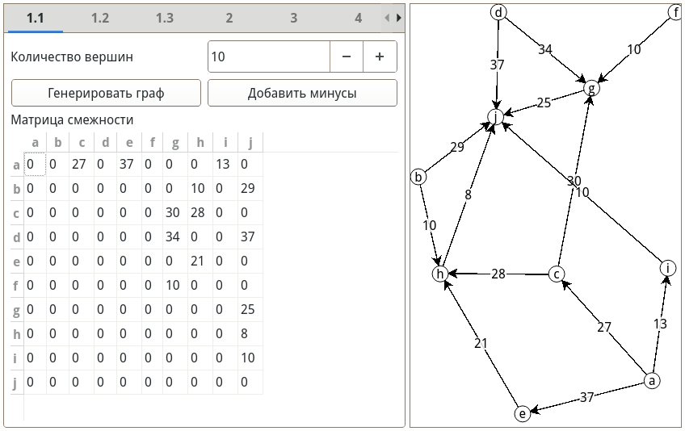

На рис. \ref{fig:shimb_min} представлена матрица Шимбелла минимальных путей для двух рёбер, на рис. \ref{fig:shimb_max} --- максимальных.

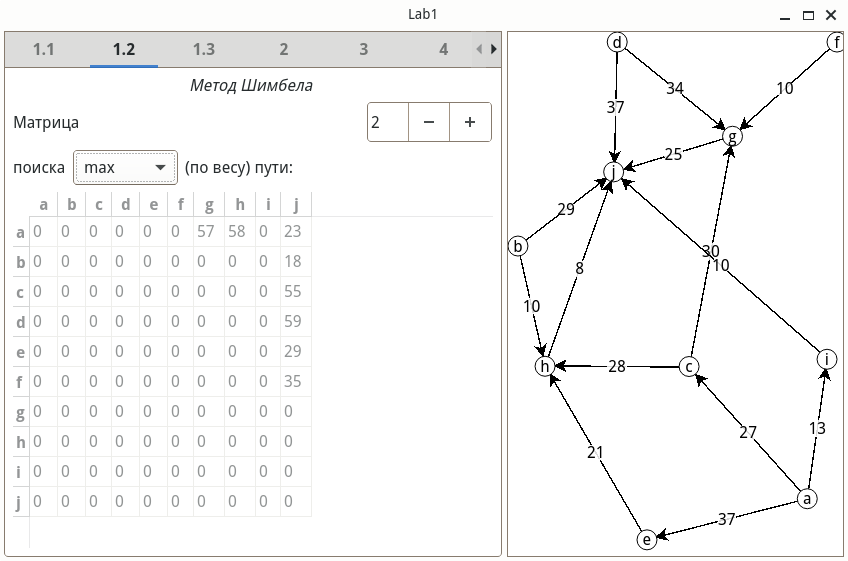

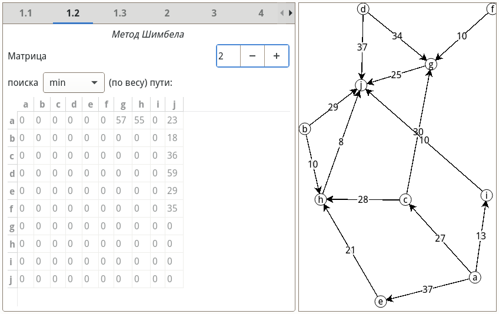

На рис. \ref{fig:path_count} показана проверка существования пути из вершины $a$ в вершину $h$.

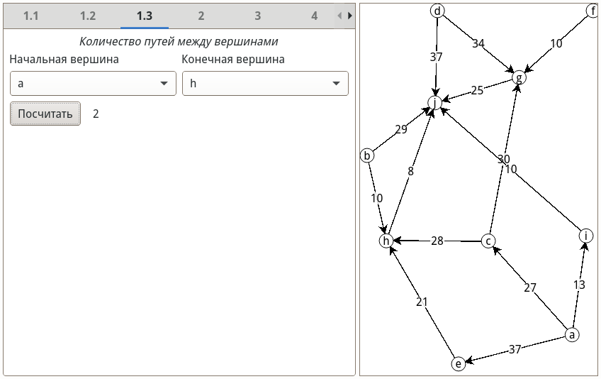

Следующие три рисунка (рис. \ref{fig:dij}-\ref{fig:f-w}) показывают работу алгоритмов по поиску
кратчайших путей в графе.

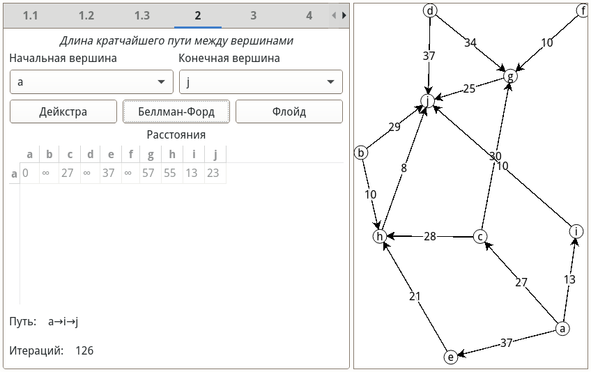

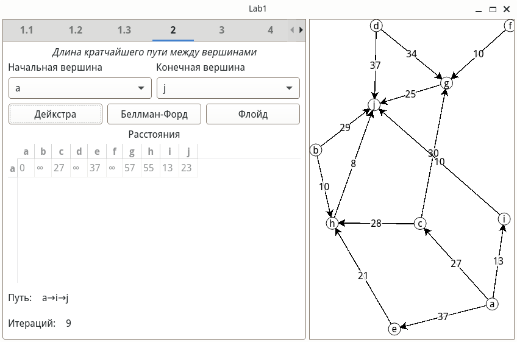

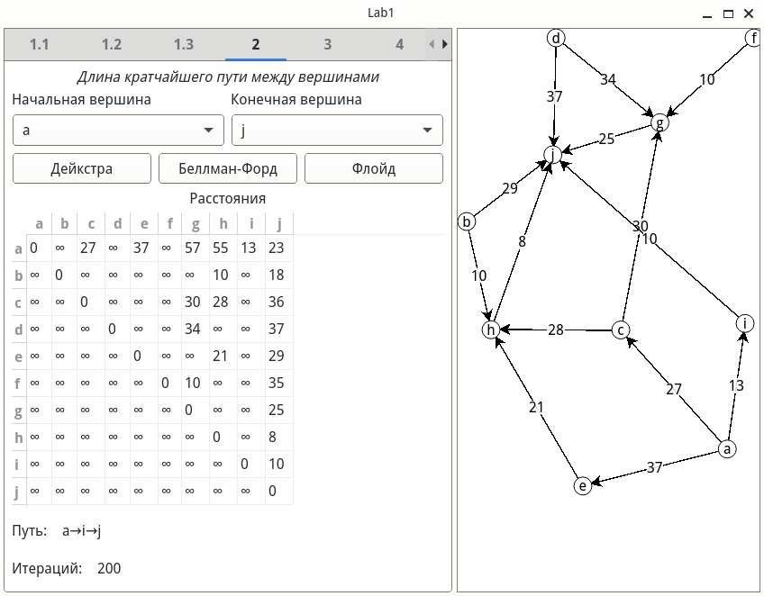

Рис. \ref{fig:gen_cost}-\ref{fig:mincost} показывают работу программы по поиску максимального потока по
алгоритму Форда-Фалкерсона, а также поиск потока минимальной
стоимости. В том числе и генерацию матрицы стоимостей.

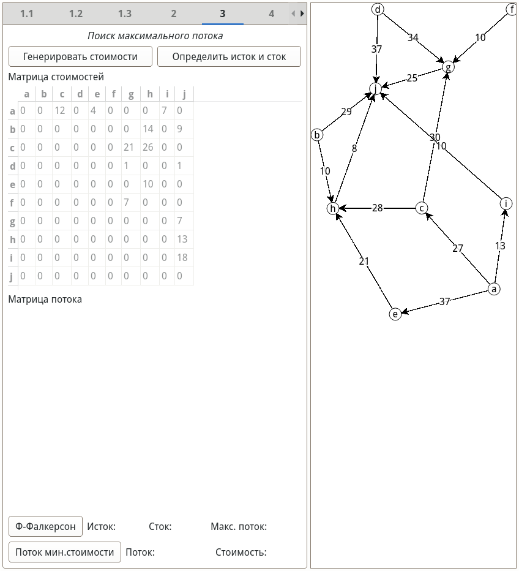

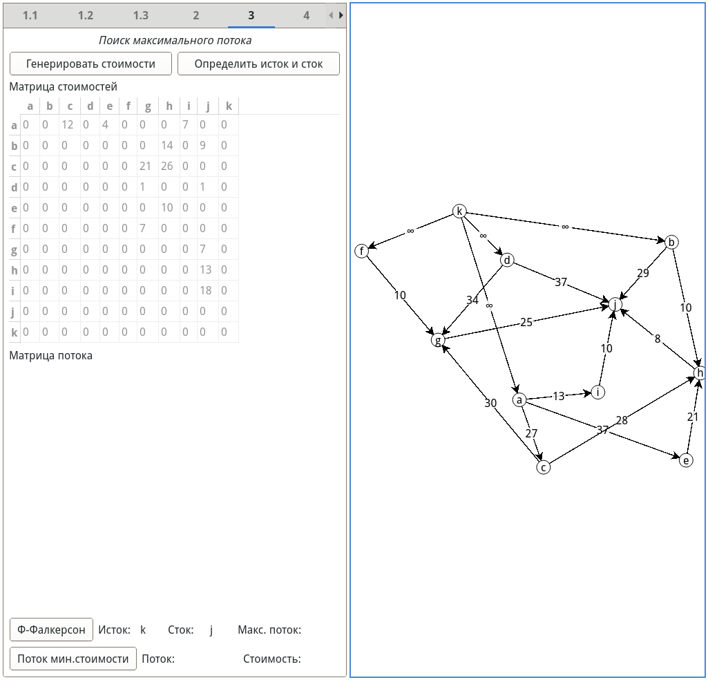


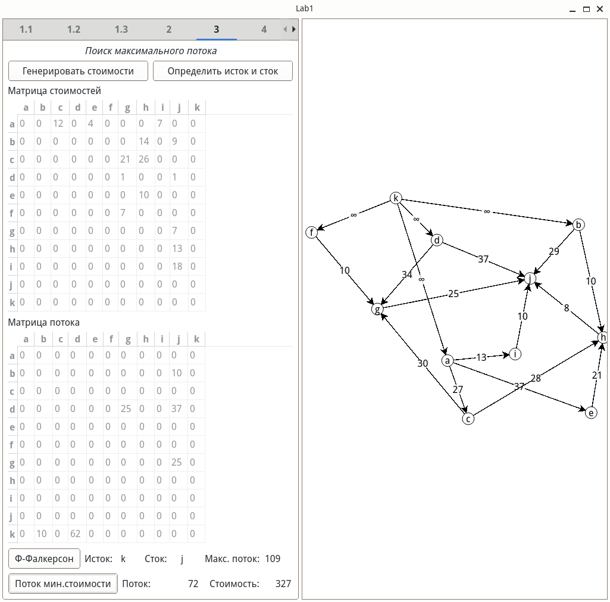

Поиск количества остовных деревьев по
матричной теореме Кирхгофа показан на рис. \ref{fig:kirghoff}.

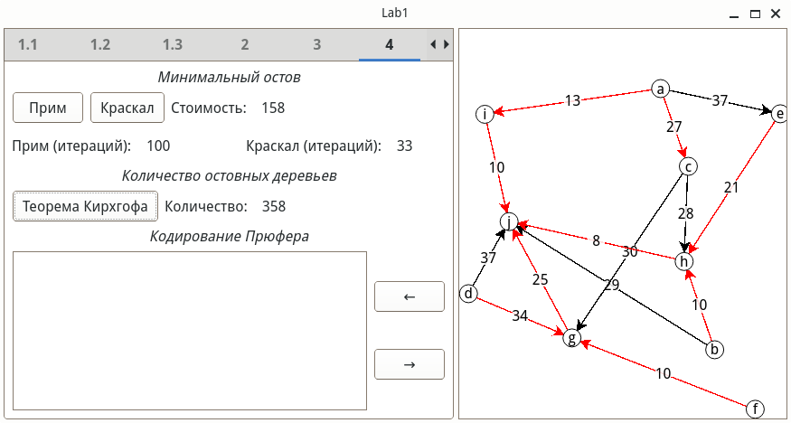

На рис. \ref{fig:encode} представлено кодирование полученного минимального остова кодом Прюфера.

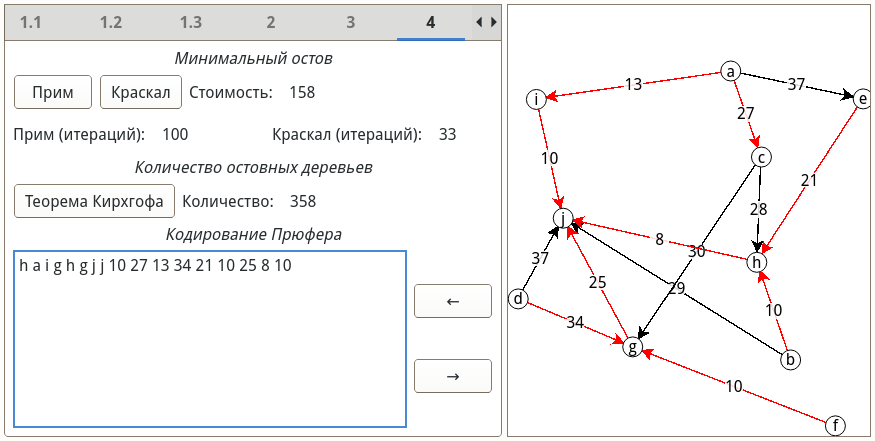

На рис. \ref{fig:decode} представлено декодирование кода Прюфера.

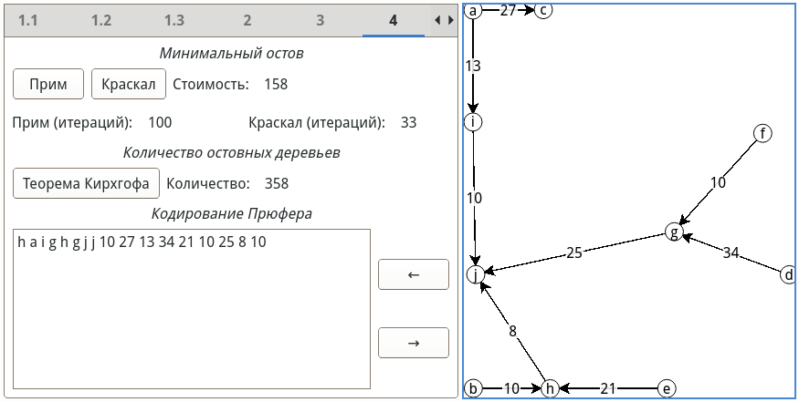

Следующие два рисунка (рис. \ref{fig:kruskal}-\ref{fig:prim})
показывают работу алгоритмов по поиску минимального остова в (неориентированном) графе.

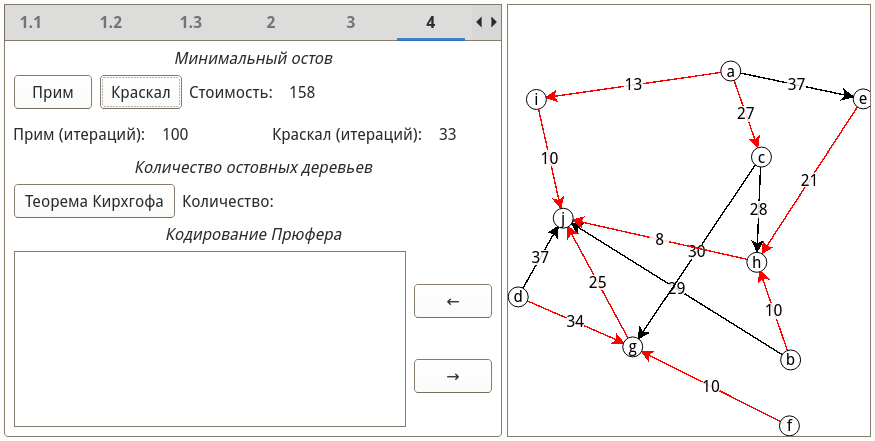

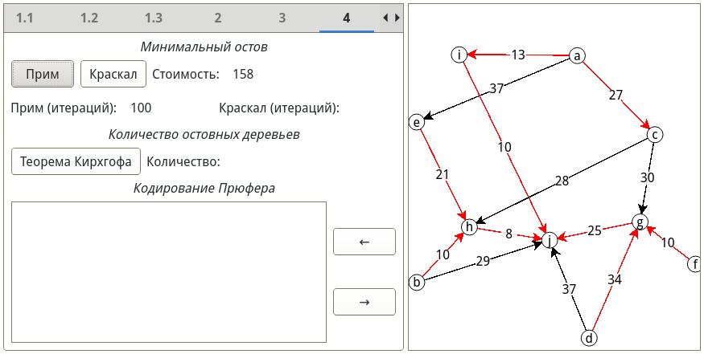

На рис. \ref{fig:is_euler} показан результат работы алгоритма, который проверяет является ли граф эйлеровым.
На рис. \ref{fig:is_ham} --- гамильтоновым.

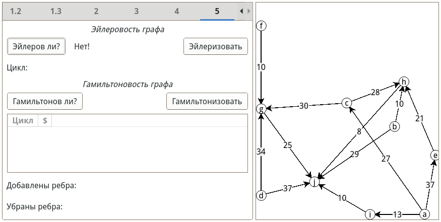

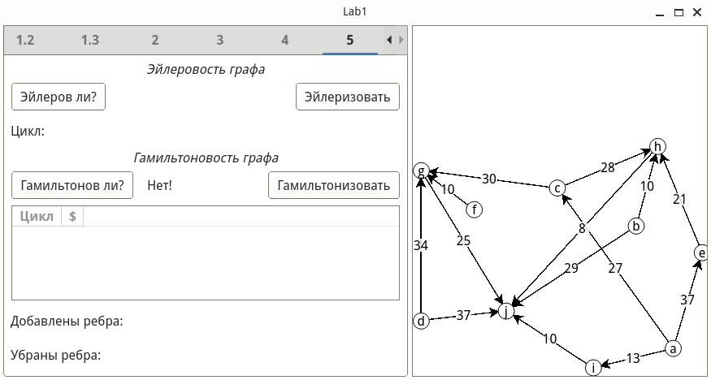

На рис. \ref{fig:eulerize} представлен результат модификации графа до эйлерова и найденный эйлеров цикл.

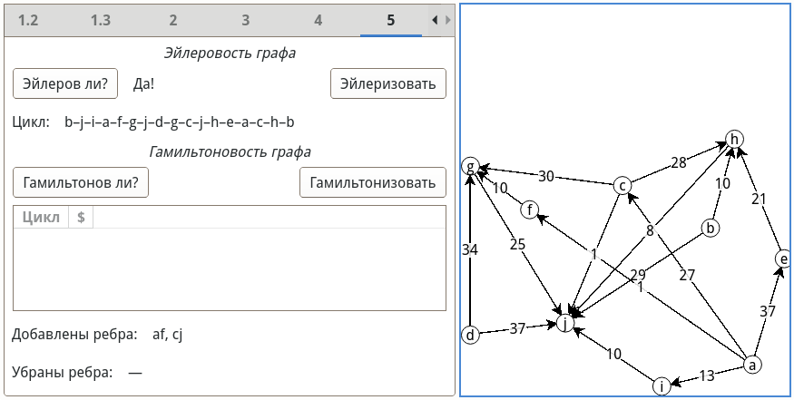

На рис. \ref{fig:hamiltonize} представлен результат модификации графа до гамильтонова и найденные гамильтоновы циклы.

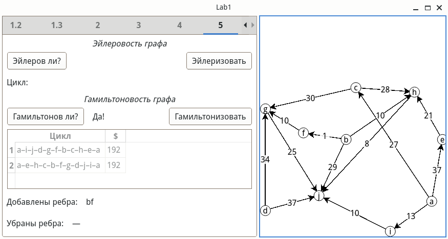

<!-- test cases for eulerize:

# n = 10

0	0	1	0	0	0	0	0	1	1
0	0	0	0	0	0	1	0	0	1
0	0	0	0	1	0	0	0	1	0
0	0	0	0	1	0	1	0	0	0
0	0	0	0	0	0	0	0	1	1
0	0	0	0	0	0	1	0	0	1
0	0	0	0	0	0	0	0	0	1
0	0	0	0	0	0	0	0	1	0
0	0	0	0	0	0	0	0	0	1
0	0	0	0	0	0	0	0	0	0
+ah, -ci

# n = 4

△_
0	1	0	0
0	0	1	1
0	0	0	1
0	0	0	0
+ac +bc

# n = 4 

☒
0	1	1	1
0	0	1	1
0	0	0	1
0	0	0	0
-ab, cd

# n = 6

△_△
0	1	1	0	0	0
0	0	1	0	0	0
0	0	0	1	0	0
0	0	0	0	1	1
0	0	0	0	0	1
0	0	0	0	0	0
+ad -ac


# n = 4

0	1	1	0
0	0	0	1
0	0	0	1
0	0	0	0
-bc

# n = 9

0	1	1	0	0	0	0	0	1
0	0	1	0	0	0	0	0	0
0	0	0	1	0	0	0	0	0
0	0	0	0	1	1	0	0	0
0	0	0	0	0	1	0	0	0
0	0	0	0	0	0	0	0	0
0	0	0	0	0	0	0	1	1
0	0	0	0	0	0	0	0	1
0	0	0	0	0	0	0	0	0
+ad+ci
--><!-- test cases for hamilton cycles list

# n = 9

0	0	0	0	24	13	14	0	0
0	0	0	0	19	0	0	6	7
0	0	0	0	0	5	19	0	11
0	0	0	0	0	0	30	0	11
0	0	0	0	0	0	0	10	23
0	0	0	0	0	0	17	0	19
0	0	0	0	0	0	0	36	18
0	0	0	0	0	0	0	0	21
0	0	0	0	0	0	0	0	0
a–f–c–i–d–g–h–b–e–a

# n = 8

K_8
0	1	1	1	1	1	1	1
0	0	1	1	1	1	1	1
0	0	0	1	1	1	1	1
0	0	0	0	1	1	1	1
0	0	0	0	0	1	1	1
0	0	0	0	0	0	1	1
0	0	0	0	0	0	0	1
0	0	0	0	0	0	0	0


# square & triangle with shared vertex

0	0	0	1	0	1
0	0	1	0	0	1
0	0	0	0	1	0
0	0	0	0	0	1
0	0	0	0	0	1
0	0	0	0	0	0
+bd -> hamilton

# square and pentagon with shared edge

0	0	1	0	0	1	0
0	0	0	1	1	0	0
0	0	0	1	0	0	0
0	0	0	0	0	0	1
0	0	0	0	0	0	1
0	0	0	0	0	0	1
0	0	0	0	0	0	0
is hamiton

### examples for n = 10

0	0	0	0	0	0	0	1	0	1
0	0	1	0	0	0	0	0	0	1
0	0	0	0	0	0	1	1	0	0
0	0	0	0	0	0	0	0	0	1
0	0	0	0	0	0	1	0	0	0
0	0	0	0	0	0	0	1	0	0
0	0	0	0	0	0	0	0	1	0
0	0	0	0	0	0	0	0	1	0
0	0	0	0	0	0	0	0	0	1
0	0	0	0	0	0	0	0	0	0
->+1 ребра de, ef, ab

0	0	0	0	1	1	0	0	0	0
0	0	0	0	0	1	0	0	0	1
0	0	0	0	0	1	0	1	0	0
0	0	0	0	0	0	0	0	0	1
0	0	0	0	0	0	0	1	0	0
0	0	0	0	0	0	0	0	0	1
0	0	0	0	0	0	0	0	0	1
0	0	0	0	0	0	0	0	1	0
0	0	0	0	0	0	0	0	0	1
0	0	0	0	0	0	0	0	0	0
-> +1 dg, ac

i=0

0	0	1	0	0	0	0	0	1	0
0	0	0	0	0	1	1	0	0	0
0	0	0	0	0	0	0	0	1	1
0	0	0	0	0	0	0	0	1	0
0	0	0	0	0	0	0	0	1	0
0	0	0	0	0	0	1	0	0	0
0	0	0	0	0	0	0	0	1	0
0	0	0	0	0	0	0	0	0	1
0	0	0	0	0	0	0	0	0	1
0	0	0	0	0	0	0	0	0	0
-> +1 de, eh, ab


0	0	0	0	1	1	0	0	0	0
0	0	0	0	0	1	0	0	1	0
0	0	0	0	0	1	0	0	1	0
0	0	0	0	0	0	0	0	1	1
0	0	0	0	0	0	0	0	1	0
0	0	0	0	0	0	0	1	0	0
0	0	0	0	0	0	0	0	1	0
0	0	0	0	0	0	0	0	0	1
0	0	0	0	0	0	0	0	0	1
0	0	0	0	0	0	0	0	0	0
-> +bg
-->

# Заключение {-}

Недостатки:

- в текущей реализации веса ребер должны быть ненулевые. Так, например, не получится добавить фиктивное ребро нулевой цены.

# Список использованных источников {-}

::: {#refs}
:::
<!--
```{.cpp include=../L1/graphs.cpp snippet=\1}
```
// start snippet \1
// end snippet \1
-->